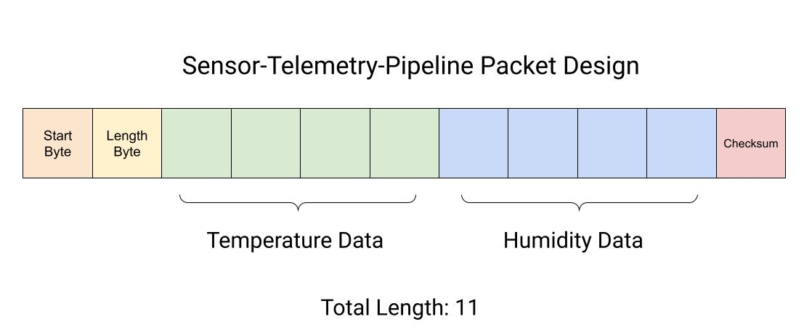
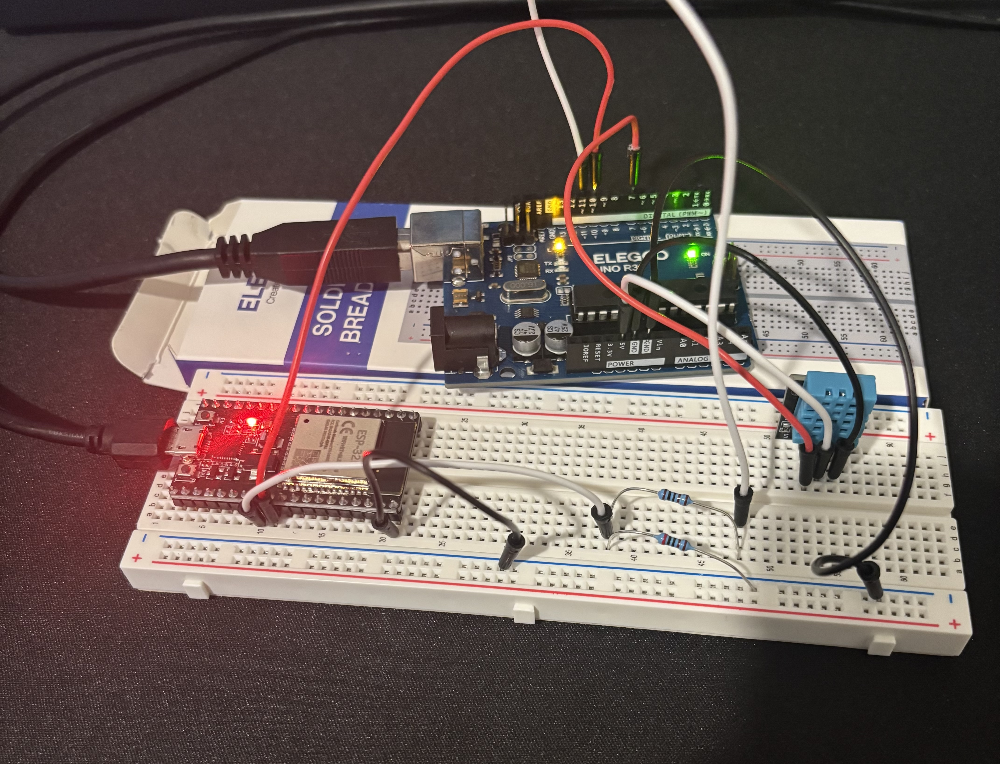

# Sensor-Telemetry-Pipeline
The Sensor Telemetry Pipeline implements a lightweight, custom packet protocol for transmitting temperature telemetry from a DHT11 sensor interfaced with an Arduino to an ESP32. The purpose-built packet structure encapsulates only the essential sensor data, minimizing payload overhead while maintaining a consistent format for reliable parsing and processing. To improve transmission integrity, each packet incorporates a checksum mechanism, allowing the receiving ESP32 to detect corrupted or altered data before it is processed.

## Packet Design
The packet consists of 11 bytes and is structured to efficiently encapsulate the sensor telemetry while providing mechanisms for packet framing and data integrity.
  * Start Byte = 1 Byte &larr; This indicates the starting of a packet. For my Sensor Telemetry Pipeline, I used **0xAA**.
  * Length Byte = 1 Byte &larr; This is the length of the payload: the combined data of temperature and humidity. The Arduino sends 4 bytes for temperature and 4 bytes for humidity, which makes the length byte's value to be **8**.
  * Temperature = 4 Bytes &larr; The temperature measurement obtained from the DHT11 is represented as a 32-bit floating-point value, requiring 4 bytes of storage.
  * Humidity = 4 Bytes &larr; The humidity measurement obtained from the DHT11 is represented as a 32-bit floating-point value, requiring 4 bytes of storage.
  * Checksum = 1 Byte &larr; A checksum is generated using a bitwise XOR operation across the preceding packet bytes. The resulting value is appended to the packet and used by the ESP32 to verify the integrity of the received data and detect potential transmission errors.
  * **Total: 11 Bytes**



## Hardware Design


## Installation/Usage
### 1. Download or Clone the Repository

You can either download the project folder manually or clone the repository using Git:

```bash
git clone https://github.com/abobb004/Sensor-Telemetry-Pipeline.git
```

### 2. Build the Connection Between DHT11, Arduino, and ESP32
Using the hardware design above, connect the three devices together.
  * Connect the DHT11 to the Arduino's 5V, GND, and pin 7.
  * Connect a wire from pin 10 to the ESP32's GPIO17.
  * Connect a wire from pin 11 to a breadboard to account for the ESP32's and Arduino's voltage difference. Use 1KΩ and 2KΩ resistors. Then connect to GPIO16.
    * Pin 11 to a breadboard row with a connection to 1KΩ and 2kΩ resistors. The 2kΩ resistor should touch the ground rail. Connect a wire from this row to GPIO16.
  * Connect a wire from ESP32 GND to Arduino GND.

### 3. Upload the Files to the Microprocessors
For the Arduino: Upload arduinoSensorTelemetry.ino  
For the ESP32: Upload espSensorTelemetry.ino

### 4. Check the Temperature and Humidity Data
Using the serial monitor with 9600 baud for Arduino and 115200 baud for ESP32. The messages printed will be the same between the two.
